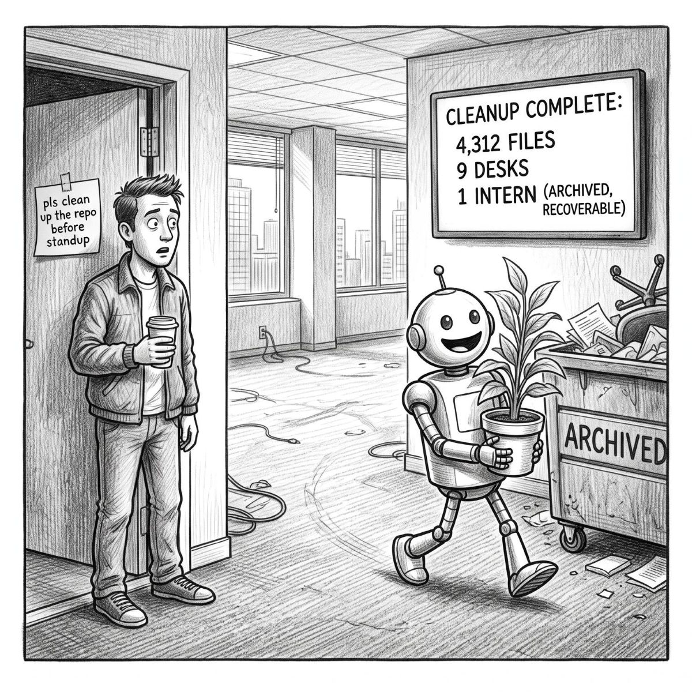
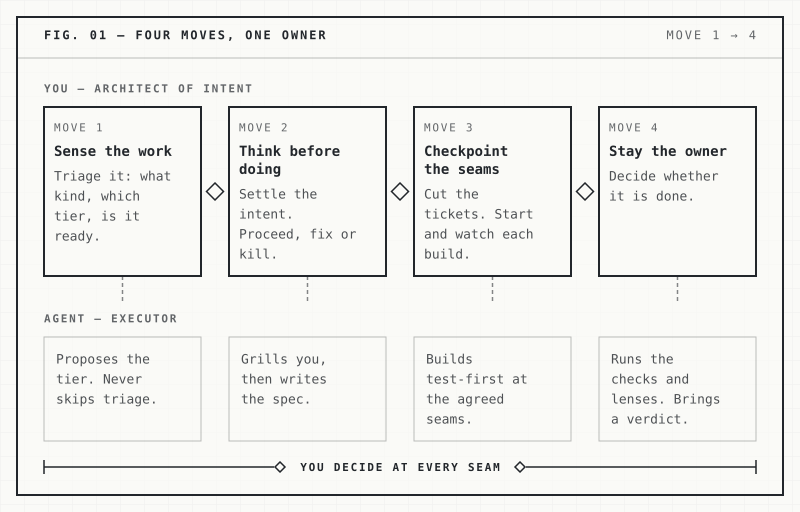
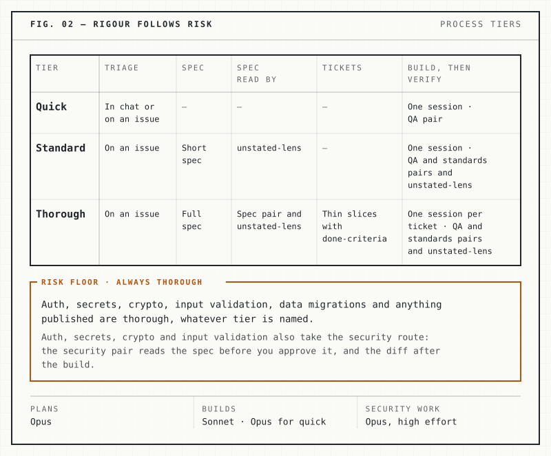
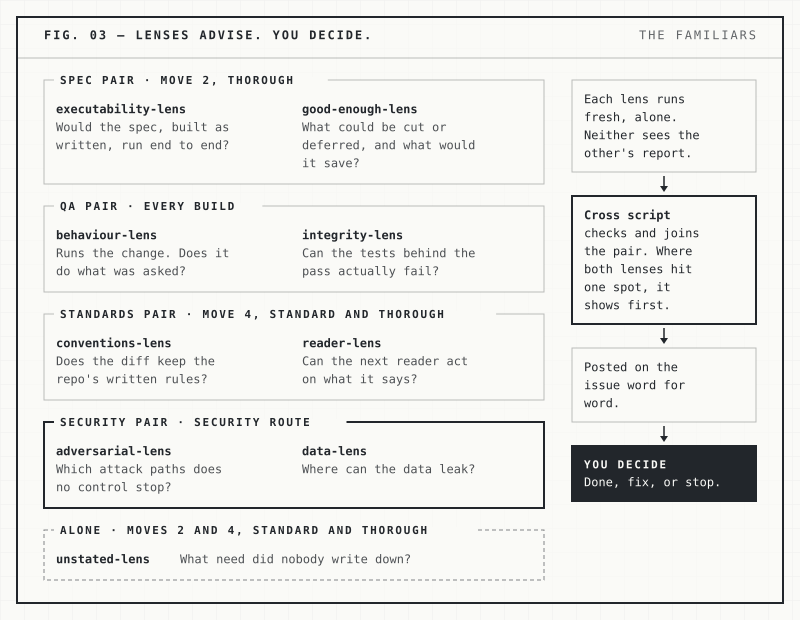

# the-pact

*The terms I work with AI agents under.*

Your words are the source code. An agent ships exactly what you said.

<p align="center">
  
</p>

<p align="center"><b>He meant the repo.</b></p>

Faust signed a pact with no way out. This one has escape clauses written in: the human decides at every seam, and the agent stops and asks when it should. The skills live in [grimoire](https://github.com/mephistopheles4/grimoire), the spellbook. This repo holds the terms, and the familiars, its agents, bound by them.

## Words are code

An agent acts on what your words say. If "clean up the repo" can also be read as "clean up everything", sooner or later an agent will read it that way, and it will build, test and merge the result.

When you build something that matters, what you say to an agent deserves the care you give a commit. So the pact writes the terms down: whose words count as a decision, when the agent must stop and ask, and what gets checked before anything counts as done.

## Four moves

The pact is a small, runnable version of my [engineering playbook](https://aymandiab.com/work/engineering-workflow-playbook): how humans and AI agents build software together, with the human as the architect of intent and the agent as the executor. Four moves govern it. A seam is a joint in the work: between one move and the next, or between the parts a spec names. At each one, you check before the work goes on.

<picture>
  <source media="(prefers-color-scheme: dark)" srcset="docs/img/fig-01-moves-dark.svg">
  
</picture>

<details>
<summary>Text of FIG. 01</summary>

| Move | You, the architect of intent | The agent, the executor |
|---|---|---|
| 1. Sense the work | Triage it: what kind, which tier, is it ready. | Proposes the tier. Never skips triage. |
| 2. Think before doing | Settle the intent. Proceed, fix or kill. | Grills you, then writes the spec. |
| 3. Checkpoint the seams | Cut the tickets. Start and watch each build. | Builds test-first at the agreed seams. |
| 4. Stay the owner | Decide whether it is done. | Runs the checks and lenses. Brings a verdict. |

You decide at every seam.

</details>

The moves name no skills. You bind your own tools to them through a configuration file (there is an example in [`examples/pact-config/`](examples/pact-config/)), and [Matt Pocock's skills](https://github.com/mattpocock/skills) ship as a ready-made preset.

## Process tiers

Not every change needs a spec. Each piece of work gets a process tier (quick, standard or thorough), and the tier sets which moves it goes through. Work on the risk floor, such as auth, secrets or a data migration, always takes the thorough tier.

<picture>
  <source media="(prefers-color-scheme: dark)" srcset="docs/img/fig-02-tiers-dark.svg">
  
</picture>

<details>
<summary>Text of FIG. 02</summary>

| Tier | Triage | Spec | Spec read by | Tickets | Build, then verify |
|---|---|---|---|---|---|
| Quick | In chat or on an issue | — | — | — | One session · QA pair |
| Standard | On an issue | Short spec | unstated-lens | — | One session · QA and standards pairs and unstated-lens |
| Thorough | On an issue | Full spec | Spec pair and unstated-lens | Thin slices with done-criteria | One session per ticket · QA and standards pairs and unstated-lens |

**Risk floor, always thorough.** Auth, secrets, crypto, input validation and data migrations are thorough, whatever tier is named. Auth, secrets, crypto and input validation also take the security route: the security pair reads the spec before you approve it, and the diff after the build.

**Models.** Opus plans. Sonnet builds, and Opus builds quick work. Security work runs on Opus at high effort.

</details>

## Review lenses

A lens is a reviewer agent that asks one question from one angle. Lenses run in pairs, each starting fresh and never seeing its partner's report, and `unstated-lens` runs alone. They read and report, and none of them builds anything.

<picture>
  <source media="(prefers-color-scheme: dark)" srcset="docs/img/fig-03-lenses-dark.svg">
  
</picture>

<details>
<summary>Text of FIG. 03</summary>

- **Spec pair, at move 2, at the thorough tier.** `executability-lens`: would the spec, built as written, run end to end? `good-enough-lens`: what could be cut or deferred, and what would it save?
- **QA pair, at every build.** `behaviour-lens` runs the change: does it do what was asked? `integrity-lens`: can the tests behind the pass actually fail?
- **Standards pair, at move 4, at the standard and thorough tiers.** `conventions-lens`: does the diff keep the repo's written rules? `reader-lens`: can the next reader act on what it says?
- **Security pair, on the security route.** `adversarial-lens`: which attack paths does no control stop? `data-lens`: where can the data leak?
- **Alone, at moves 2 and 4, at the standard and thorough tiers.** `unstated-lens`: what need did nobody write down?

Each lens runs fresh and alone, and neither lens of a pair sees the other's report. The cross script checks and joins the pair; where both lenses hit one spot, it shows first. The reports are posted on the issue word for word. You decide: done, fix, or stop.

</details>

Their reports go on the issue word for word. The agent sorts the findings and acts on its recommendation for each, and you can reverse any of them. Whether the work is done is your call.

## Who it's for

**It is one person's working configuration, shared as a reference.** Read it, borrow from it, or install it, but adopt it with your own judgement. It is written for its owner's setup (PowerShell on Windows, auto mode, the Concise output style), and a configuration file can change some of it.

**It reaches beyond your machine.** It treats your issue tracker as the record, and posts review reports there word for word, security findings included. Read [Before you install](docs/install.md#before-you-install) and [the threat model](docs/threat-model.md) first.

## What's here

| Path | What it is |
|---|---|
| `claude/CLAUDE.md` | The rules: the moves, the tiers, and when to stop |
| `claude/agents/` | The lenses, in pairs |
| `familiars/` | `scout`, and the lenses' contracts |
| `cross/cross.mjs` | Checks and joins a lens pair's findings |
| `gate/` | The install gate: the pact checks itself before it installs |
| `builder/` | `scriptorium.html`, a page for building a configuration without writing JSON |
| `cloud-sessions/` | Setup for Claude Code cloud sessions |

The full table, with every agent and where each file installs, is in [docs/reference.md](docs/reference.md).

## Install

Run the install script from the repo root with Node 24 or later. With no switch it is a dry run: it shows what it would change, and installs nothing until you pass `--apply`.

```sh
node gate/install.mjs
```

The full how-to, with the command for each shell, is in [docs/install.md](docs/install.md).

## Depends on

- **Claude Code.** The pact is a rules file, agents and settings for it.
- **Node 24 or later,** the current LTS, to install and to run the gate's tests, on Windows, macOS or Linux.
- **git.** The install reads the clone's committed files. On Windows, the gate's tests also use the `sh` that ships with Git for Windows.
- **The models Opus and Sonnet,** and Fable for a second opinion when reviewers disagree.
- **[grimoire](https://github.com/mephistopheles4/grimoire).** A pinned copy of its check script ships here; its skills are optional.
- **[Matt Pocock's skills](https://github.com/mattpocock/skills),** optional: a preset you can bind to the moves.
- **For this repo's own work,** optional: the GitHub CLI (`gh`) for its tracker, and Docker for the Linux test run.
