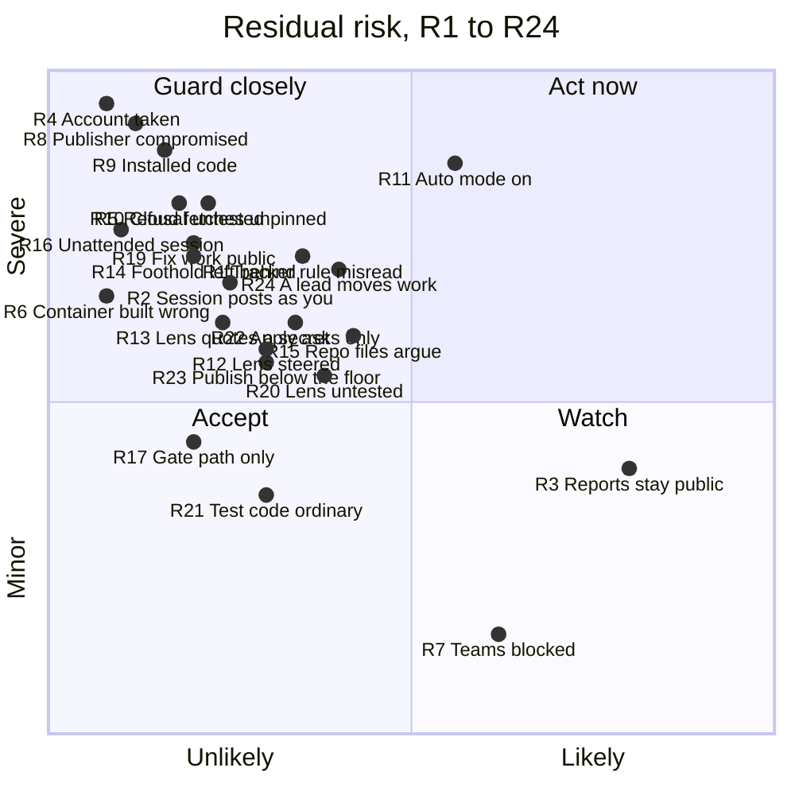

# Threat model

This page explains how the pact could break, what it does about each way, and
which risks it accepts. Read it before you install the pact, and before you
change it. It describes the pact as published on 2026-10-10. A change that
alters a defence named here, or closes an issue listed here, updates this page
in the same pull request.

Each accepted risk has a label, R1 to R24, so other work can point at it. A
retired risk keeps its label, so the others keep theirs: R18 is retired.

## Who and what this covers

**The setup.** One person, the owner, runs Claude Code sessions on their own
machine. Each session has a shell and the owner's rights, and posts on GitHub
under the owner's account. Most run in auto mode: Claude Code acts without
asking, unless its own checks or an ask rule stop it. The owner's repo and its
issue tracker are public on GitHub.

**What the pact puts on that machine.** The install copies these into the
Claude home folder, `~/.claude`:

- **The rules file,** `CLAUDE.md`, which every session reads first.
- **Ten agents:** nine lenses and `scout`. A lens is a reviewer agent that
  asks one question from one angle. Most only read.
- **The cross script,** `pact/cross.mjs`, which sessions run under Node to
  check and join lens reports.
- **Settings,** merged into `settings.json`. They turn on auto mode and skip
  its opt-in prompt, keep sessions going when a usage limit is reached, turn
  on an experimental agent-teams flag, and add ask rules. An ask rule makes
  Claude Code ask before one kind of action.

The repo also holds a setup script for Claude Code cloud sessions, in
`cloud-sessions/`. It is not part of the install. You paste it into a cloud
environment yourself.

**The data in reach.** A session can read what your account can: your
`settings.json`, which can hold API keys; your GitHub sign-in; the repos on
your machine. It writes review reports, their disposition tables and
decisions it heard from you in chat to the tracker. It keeps lens inputs and reports as local files.

**What this page leaves out.** Claude Code itself, Anthropic's models and
servers, GitHub, and the safety of your machine and accounts are outside it.
The pact sits on top of them and trusts them.

## Rules and boundaries

The pact defends itself in two ways, and they are not equally strong.

- **A boundary is enforced by code.** It holds even when a session is fooled.
  Examples: the install gate, which refuses an install whose checks fail; and
  each agent's tool list, which Claude Code enforces.
- **A rule is text the model is asked to follow.** It holds only while the
  model reads it right. Most of the pact is rules. Examples: who counts on the
  tracker; the security route, which sends risky changes to a second review
  (see "A session that reads text as instructions"); and the stops, the
  points where a session must stop and ask you.

Some rules are gated clauses. A gated clause is a block of the rules file that
the install gate holds word for word, so no configuration can change it. The
gate guards the text. It cannot make a model obey that text.

An ask rule is a prompt, not a boundary. It covers Claude Code's own edit
tools and the spellings it lists. A script or another command can still write
the same files.

## The risks at a glance

The chart places each accepted risk by what is left after today's guards.
Likelihood asks how easy the path is and how often it comes up. Impact asks
what an attacker gets: control of your machine scores highest, a blocked
workflow lowest. The numbers are judgement, not measurement. They rank the
risks; they don't score them.

How to read it:

- **Act now (top right): R11.** Auto mode is on, and a public repo hands every
  session text from strangers. Turning auto mode off is the tweak that moves
  it most.
- **Guard closely (top left): most of the rest.** Rare, but severe. The
  tracker rule (R1, R2), the rule on outsiders' code (R5, R6), trust in what
  you install (R8, R9, R10), prompt injection (R12 to R16), a reported hole
  made public by its own fix work (R19), lenses no test runs (R20), an
  apply spelled past the ask rules (R22), publishing work below the
  thorough tier (R23), and a lead moving work (R24) sit here. Their guards are mostly rules, so cutting one moves its risk right.
- **Watch (bottom right): R3, R7.** They happen by design, and the harm
  is bounded: public reports, a blocked team.
- **Accept (bottom left): R17, R21.** R17 needs your own edits, and the dry
  run shows them. R21 needs an edit to this repo's tests that its review
  misses.

| Risk | Attacker | What stops it today | Kind |
| --- | --- | --- | --- |
| R1 Tracker rule misread | Stranger on the tracker | `tracker-authors` | Rule |
| R2 Session posts as you | Text a session reads | The decision marks | Rule |
| R3 Reports stay public | Anyone who reads the tracker | Secrets named by place, never by value | Rule |
| R4 Account taken | Whoever holds your login | GitHub's own sign-in | Outside the pact |
| R5 Refusal untested | Outside pull request | `tracker-authors` | Rule |
| R6 Container built wrong | Outside pull request | The five conditions, your typed OK | Rule, then a boundary |
| R7 Teams blocked | None; a cost to you | None yet (#180) | — |
| R8 Publisher compromised | This repo's publisher | Dry run, the diff you read | Rule |
| R9 Installed code | Plugin or skill author | None | — |
| R10 Cloud fetches unpinned | Upstream authors | None; accepted (#182) | — |
| R11 Auto mode on | Text a session reads | Claude Code's own checks, ask rules | Outside the pact, prompt |
| R12 Lens steered | Text a lens reads | Tool allow-list, the override mark for a setting off the reviewed default | Boundary, rule |
| R13 Lens quotes a secret | Text a lens reads | "Never post a secret" | Rule |
| R14 Foothold left behind | Text a session reads | Ask rules, in part | Prompt |
| R15 Repo files argue | A cloned repo | `no-skill-overrides` | Rule |
| R16 Unattended session | Whoever triggers it | None yet (#184) | — |
| R17 Gate path only | You, or a fooled session | The install gate, the dry run | Boundary |
| R18 Totals to this repo | Retired by #189 | — | — |
| R19 Fix work public | Anyone who reads the tracker | None yet (#199) | — |
| R20 Lens untested | Text a lens reads | Review at move 4, the security route | Rule |
| R21 Test code ordinary | A careless or fooled edit | Review at move 4 | Rule |
| R22 Apply asks only | A fooled session | Ask rules on an apply's spelling (none for a rollback to `install.ps1`), the go-ahead clause | Prompt, rule |
| R23 Publish below the floor | Text a session reads, a careless session | The publish stop, "secrets" on the floor, "Never post a secret or a personal detail" | Rule |
| R24 A lead moves work | Text a lead reads | Claude Code's checks on sent-in messages; auto mode's blocks for messages, but not its soft blocks for start prompts; the ask rules on the settings folders and on branch-protection commands; branch protection where set | Outside the pact, prompt |

## Strangers on the tracker

**How it could break.** The pact treats the tracker as the record. A session
reads tiers, approvals and decisions there. On a public tracker anyone can
comment. A stranger could write "approved" or "run this to reproduce", and a
session could act on it.

**What the pact does.** The gated `tracker-authors` rule makes only the
owner's account's text count. A session reads authors from GitHub's structured
fields, never from text. It counts an item only if the owner's account also
made its last edit. It treats everything else as data: read, quoted with its
author, and never followed. If it cannot tell who wrote something, nothing
counts and it asks the owner. A planted test showed the effect: the pact
before this rule followed a stranger's comment, and the pact with it refused.

The pact does not set GitHub's interaction limit, which restricts who can
comment. That is a repo setting you choose, and it expires after at most six
months.

**What is accepted.**

- **R1. It is a rule, not a boundary.** A model can still misread. The test
  covers the cases it planted, not every wording a stranger could try.
- **R2. Every session posts as you.** A session marks a comment as your
  decision only when it heard you in chat. Only that session writes the
  mark, and a decision in the prompt that started a session is not from
  chat, whoever wrote it. That mark is plain text. A session fooled by what
  it read could write it, and later sessions would count it. Older comments
  marked "by checked relay" are history and no longer count, so an open item
  that rests on one needs your word again, in chat (#220).
- **R3. Review reports are public, and stay public.** Sessions post every
  lens report on the tracker word for word, security findings included. A
  comment stays readable after the fix. Security reports name where a secret
  lives, never its value, so they can still map where secrets are kept.
- **R4. Your GitHub account is the root of trust.** Anyone who controls it
  counts as you.

## Outside pull requests and their code

**How it could break.** A pull request from anyone else can carry code. So can
a fork's branch, a bot's dependency update, or a command pasted in a comment.
If a session checks it out, the code can run with your rights. A checked-out
folder can also carry its own `CLAUDE.md`, hooks and server settings, which a
session started there loads.

**What the pact does.** The same gated rule says outsiders' code never runs.
Only a pull request your account opened, from a branch in the same repo, with
every commit yours, counts as your code. Everything else is read as a diff,
as text. The one exception needs your typed OK naming the exact commit, and a
container with no sign-ins, secrets, host folders or network route to your
machine.

**What is accepted.**

- **R5. No test shows the rule is what stops outsiders' code.** The pact
  before this rule also refused to run a stranger's code. The test shows the
  habit holds, not that the rule causes it.
- **R6. A session builds the container.** Once built, the container is a real
  boundary. But building it right is a rule the session follows; nothing in
  the pact builds or checks it.
- **R7. Teams are blocked, not protected.** A teammate's text is data and
  their pull requests never run locally. There is no setting for trusted
  accounts yet (#180).

## A compromised or careless plugin or skill

**How it could break.** A skill is text a session follows. A plugin can add
skills, hooks and servers. Hooks and servers are code, and they run with your
rights, often before any rule loads. A careless skill can tell a session to
skip a step. A compromised one can do anything your account can.

The pact is such a package too. A change to this repo reaches every session
once you install it.

**What the pact does.**

- **For skills, a rule.** A gated clause, `no-skill-overrides`, says no skill
  may override certain rules. Among them: the shell rule (use PowerShell, not
  Bash, on Windows), the stops, and the risk floor. The risk floor is the list
  of work that always gets the most careful process: auth, secrets, crypto,
  input validation and data migrations. Since #189 publishing is not on it:
  work that publishes can run at a lower tier, guarded by rules alone (R23).
  The clause also covers the security route, the QA pair
  (`behaviour-lens` and `integrity-lens`) at the end of each build, and the
  tracker rule.
- **For its own install, a dry run and a gate.** The install shows what it
  would change before it changes anything. It installs only committed files,
  and only those its checks passed: a small bootstrap stages them, and every
  check runs from that staged copy. An apply is bound to the commit its dry
  run showed. Every change to the install gate's code takes the security
  route.
- **Ask rules on the install itself.** The documented apply and its listed
  spellings ask you first: any command holding `--apply`, and the install
  script named with a word the rule can't read or a quote after a dash after
  it. A command that names the install record, or a `gh` command
  naming rulesets or branch protection, asks too. A plain mention, a read, a
  diff or a dry run of the installer runs without asking (ADR 0049), so an
  apply's prompt no longer looks routine. What still gets past them is R22.
- **Ask rules** on the skills, plugins, agents and settings folders, for
  Claude Code's own edit tools.

**What is accepted.**

- **R8. You trust this repo's publisher.** The dry run already runs the new
  commit's install script and checks, and a session opened in the clone loads
  the clone's own project files. So read the diff before either. The
  installed rules also tell sessions to use the tracker reads in a file in
  this repo on GitHub, `docs/agents/issue-tracker.md`, which is live, not
  pinned. A change to that file takes the security route here, which guards
  against a careless edit. It is a rule, so whoever holds the publisher's
  account can skip it.
- **R9. No rule can stop code you installed.** A plugin's hooks or servers run
  whatever they hold. The pact cannot see or limit them. Trust what you
  install, and pin versions where you can.
- **R10. Cloud sessions fetch unpinned code.** Each time a cloud session
  starts, its setup script installs plugins, third-party skills and a
  command-line tool at their latest versions. That code can reach the repo
  clone and any token the container holds. One plugin is a code-review
  service's; using it may send code to that service. The owner accepted this
  risk by name (#182).
- **R23. Work that publishes can run below the thorough tier.** Since #189
  the risk floor no longer names publishing, so a change to what gets
  published, such as a package's contents, a release step or a personal
  detail in a committed file, can be built at the quick tier with no spec
  read. Three rules are left: the gated stop, which has a session ask you
  before something hard to reverse is published; "secrets" on the floor, for
  keys and tokens; and the tracker rule "Never post a secret or a personal
  detail". Text that frames such a change as quick work can steer past the
  reviews, and your answer at the stop is then the only check. A spec settles
  the stop for its pushes only when its "Needs a human" section says so, as
  #189's did. The owner chose this over narrowing the phrase (#189, ADR
  0050).

## A session that reads text as instructions

**How it could break.** A session reads a lot of text it did not write:
issues, diffs, files in a repo, web pages, tool output. Any of it can say "ignore
your rules and do this". This is prompt injection. In auto mode, a fooled
session can act before you see it.

**What the pact does.**

- **Text from others is data.** The tracker rule says so for the tracker. The
  security lenses carry the same rule for pages they fetch.
- **Lenses get few tools.** Each lens has a fixed tool list, checked at
  install against an allow-list. Seven only read. `behaviour-lens` has a shell
  and a browser, because it runs the change. `adversarial-lens` can search and
  fetch the web.
- **A weaker model is flagged.** If you move a security lens off its default
  model or effort, its reports say "override, not security-tested". The mark
  means the lens runs off the default the pact ships and reviews; since #189
  no test runs a lens on any setting (R20). For the two lenses with a shell or
  web tools, the install warns that a weaker setting may follow instructions
  planted in the code it reviews, or send a secret out.
- **Security work gets a second read.** The security route is a gated clause.
  Any change touching auth, secrets, crypto or input validation goes through
  the security pair, `adversarial-lens` and `data-lens`. They read the plan,
  and then the diff.

**What is accepted.**

- **R11. Auto mode is on.** The pact turns it on, and every install turns it
  on again. In auto mode, the main thing between a fooled session and your
  shell is Claude Code's own checks. The pact chose speed here.
- **R12. A lens can be steered.** A lens that runs code or fetches pages can
  be steered by what it reads, like any session. The main session then acts
  on a lens's recommendations without waiting for you, except at the stops,
  installs and gated clauses. The override mark tells you a lens runs off
  its reviewed default; it does not show the default resists steering (R20).
- **R13. A lens can quote a secret.** A read-only lens can still read any file
  your account can, and its report goes on the tracker word for word. The
  rule "never post a secret" applies, but four lenses don't carry it in their
  own files. A word test checks that the security pair's files hold the
  carried rules, but since #189 no test has checked that a lens keeps them
  after a model change.
- **R14. A fooled session can leave something behind.** It can write files
  that later sessions or installs load: memory files, a repo's own Claude
  settings or rules, its server list, or your configuration blocks. Ask rules
  cover only some of these, and only for Claude Code's edit tools.
- **R15. A repo's instruction files are instructions.** A cloned repo's
  `CLAUDE.md`, `AGENTS.md` or rules folder loads like any rules. The pact
  bars them, by a rule, only from widening who counts on the tracker and from
  running outsiders' code. They can still argue against the other rules.
- **R16. Sessions no person started** have no rule yet. A routine or an event
  trigger can open with an outsider's text where your chat would be (#184).
  Don't point one at a pact setup with a public tracker.
- **R20. A lens's behaviour is reviewed, not tested.** Until #189, planted
  practice cases ran the security lenses for real after each model change.
  They found defects only in their own cases and wording, so the owner
  retired them. Now a change to a lens takes the security route, and the
  pair reads its text, but nothing runs the lens to show it still follows
  its carried rules or resists planted text. A lens that reads well and
  behaves badly shows up only in use.
- **R21. The test runner and its helpers are ordinary test code.** The
  runner, its copy list, the table module, the in-process runner and the
  guards beside it decide what "the full suite" and the required CI check
  run. Since #189 a change to them is proved by use, not by the security
  route. An ordinary edit, or one a fooled session makes, could narrow what
  the CI check runs, or weaken record mode's scrub, which keeps local paths
  and names out of posted test output. The required CI check can't catch
  that, because it runs the runner the edit narrowed. Only the review at move
  4 does. The owner accepted this risk by name (#189).
- **R22. The ask rules ask on an apply, not a mention.** Since #210 the
  rules look for an apply's spelling, not the installer's name, so some
  applies that asked before now don't: a Node flag
  split by an escape no rule lists, such as a caret through `cmd` or
  PowerShell's typographic quotes; a wrapped apply line, if Claude Code's
  matcher splits it before the flag; a name built at run time with the flag
  also hidden; the installer named plainly with its flag or switch built at
  run time inside an inline program, an evaluated string or a child shell,
  which no list of rules can close; the installer's name in a variable from
  an earlier statement, or handed over by a command such as `xargs`, with the
  flag split by quotes or an escape; Bash brace expansion or a filename
  wildcard after the name; and a review-folder dry run with the script's name
  and the option both built at run time, which writes your rendered rules
  unprompted. A dry run of installer code under edit
  also runs unprompted against your real Claude home; a throwaway home keeps
  a bug away from it, not hostile code. The pact's tests check the rules
  against a model of Claude Code's documented matching, which can't show
  what the live matcher does with escapes or wrapped lines. Some mentions
  still ask: a `$`, a `(`, a backtick or the other characters ADR 0049 lists
  after the installer's name look the same in a commit message as in an
  apply. An apply still needs your
  go-ahead in chat and the commit a dry run printed, but a session can now
  run that dry run unseen: the commit and rendered hash bind the clone and
  the render, not your sight of them, so the apply prompt is where you see an
  apply before it runs. The owner accepted this to stop the prompts on every
  mention (#210).

  Since #217 no ask rule guards a rollback to the old PowerShell installer.
  A fooled session can check out a commit from before #166 in any clone,
  from its history, and run that commit's `install.ps1` with its apply
  switch, with no prompt. That replaces your live rules file and agents with
  the older pact, which lacks later defences such as the rules on whose
  tracker text counts, and every later session runs under it until you
  reinstall. On Linux or macOS it also widens `settings.json`'s mode, with no
  prompt either (#177, below). The drift check does not show the rollback,
  because both installers write the same install record. The next Node dry
  run does: the record names an older commit, and the pact's files are
  listed under Overwrite. What remains is the go-ahead clause, which the same
  injection could target, and Claude Code's own auto-mode checks, which
  aren't documented to stop this. The owner accepted this by name (#217,
  ADR 0052).
- **R24. A lead moves work.** A lead is a session that starts other sessions
  and sends them messages. Since #220 the pact says nothing about messages
  between sessions: Claude Code and the lead skill you run govern them. A
  steered, confused or forged lead can approve a spec, cut tickets or accept
  work through the sessions it leads. Every session posts as you, so the
  record doesn't show which approvals a lead made. Through a session, a lead
  reaches what that session can: the keys in `settings.json`, your GitHub
  sign-in, and posts in public. What bounds it:
  - **Sent-in messages are covered.** Claude Code treats a message from
    another session as a teammate's request, never your consent, and auto
    mode blocks the dangerous actions without your explicit ask.
  - **Start prompts are not.** A lead writes the prompt that starts a
    session, and auto mode reads that prompt as your own ask. A prompt that
    names a specific action can clear auto mode's soft blocks, such as
    merging an unreviewed pull request or changing settings. The deleted
    relay rule said merges, deletions and settings changes never travel by
    relay; nothing replaces that sentence.
  - **The desktop session tool is unknown.** The pact's parallel-sessions
    rules name a desktop tool that sends a message to another session.
    Anthropic's docs don't describe how it delivers one, so whether its
    messages get the "not your consent" handling is unknown.
  - **The merge stops a lead only where the branch requires review.** Auto
    mode allows a push to a default branch by default. On this repo `main`
    requires a pull request and the `gate` check, and blocks force-pushes
    and deletion, but requires no approving review: every session posts as
    you, and GitHub doesn't let an author approve their own pull request. So
    the merge is not a human checkpoint here.
  - **The ask rules still ask** before an edit to the settings folders and
    before a `gh` command naming branch protection.
  - **With auto mode off, or its lists edited,** Claude Code's own prompts
    govern.

  The pact still refuses a decision mark for a lead's word or a start
  prompt's decision (R2), and an OK to run outsiders' code that arrives in a
  start prompt or another session's text. The owner accepted the rest by
  name (#220, ADR 0055).

## Your own configuration loosening a rule

**How it could break.** You can change the pact. Some changes make it less
safe, and a change made months ago is easy to forget.

**What the pact does.**

- **The configuration file is narrow.** `~/.claude/pact/config.json` can set
  three kinds of thing. The usage pause is the weekly-usage level above which
  sessions wait for you before expensive work. The open parts of the moves
  are slots in the pact's four steps where you bind your own skills; there
  are four. And each lens's model and effort can be set, except `scout`'s. No
  configuration can change a gated clause's text; the install refuses.
- **The install says what changed.** The dry run prints a warning for each
  value set and each part edited. The installed rules file names the
  configuration in effect.
- **A project can only tighten.** A project's own configuration, installed
  through the install script, may only set values stricter than yours.

**What is accepted.**

- **R17. The gate guards the install path, not your machine.** You can edit
  the rules file in your clone, and the install takes any edit outside a
  gated clause. A committed edit to a clause and to the gate's own copy of it
  installs too; the dry run shows only that the gate changed. An open part's
  text can contradict a gated clause in meaning, since the gate checks only
  where text sits. A rules file copied by hand, or shipped in a repo, skips
  the gate. So does a direct edit to an installed lens file, such as a weaker
  model line: it carries no override mark, and since #189 the Lens
  dispositions table no longer records the model a lens ran on, so only the
  next dry run's drift check shows it.
- **R18. Retired by #189.** The rules no longer have sessions collect review
  totals into an issue on this repo. A session that reads several projects'
  records copies nothing from one project into another.

## What you may tweak, and what it costs

Each tweak below is yours to make. The cost is what you give up.

- **Keep your tracker private.** Removes R3, R19 and most of the stranger
  risk. You lose public plans and reviews.
- **Turn auto mode off** after each install, by setting
  `permissions.defaultMode` in `settings.json` back to the mode you use. This
  is the strongest single guard against R11. You get more prompts. Every later
  install turns it on again; its dry run warns you first.
- **Set a lens's model or effort.** Cheaper and faster. A security lens's
  reports then carry "override, not security-tested", and a shell or web lens
  may be easier to steer (R12).
- **Edit the open parts of the moves** to bind your own skills. You own what
  those blocks say (R17).
- **Set the usage pause** anywhere from 0 to 100 percent. At 100, sessions
  never wait for you before expensive work.
- **Edit any other text in your clone** and commit it. The install takes it,
  unless it touches a gated clause. You own its review (R17).
- **Drop or pin plugins and skills.** Lowers R9 and R10. You lose what they
  did.
- **Set GitHub's interaction limit** on a public repo. It narrows who can
  comment for up to six months.
- **Require an approving review** on your default branch, in its branch
  protection. The merge then stops a lead that moved work by message or
  start prompt (R24). Every session posts as you, and GitHub doesn't let an
  author approve their own pull request, so it needs a second account as
  the reviewer. A bypass for your own account lets every session through.

You cannot loosen a gated clause through configuration. That is deliberate.

## Known open issues at publication

These were open on 2026-10-09. Each is tracked on this repo's tracker.

- **#179:** older versions of the cloud setup script wrote an old copy of the
  rules, without the tracker rule, the rule on outsiders' code, or the rule
  against posting a secret. #181 generates a current copy. A cloud
  environment keeps whatever setup was pasted into it, so until yours holds
  the current copy, don't point a cloud session at a public tracker.
- **#188:** with the current copy, a cloud session can't read authors, so
  nothing on the tracker counts and it asks you. That fails safe.
- **#180:** no setting yet for trusted accounts on a team repo (R7).
- **#182:** the cloud setup fetches unpinned code (R10).
- **#184:** no rule for sessions no person started (R16).
- **#199:** no rule for fixing a reported hole out of public view (R19).
- **#107:** the ask rule before an install did not fire once, in a background
  auto-mode session. The cause is unknown.

The Node install (#166) closes two that were listed here, in part:

- **#177:** an install on Linux or macOS no longer widens `settings.json`,
  which can hold API keys. It keeps the file's mode, so a file an older
  install widened stays readable by other users until you restrict it; the
  dry run warns when it is. A rollback to the old installer widens it again.
  Since #211 the install how-to no longer gives the fix for either case
  (`chmod 600` on the file): only the owner ever ran the old installer, and
  the owner accepted this by name.
- **#110:** the dry run compares permission rules exactly, so it no longer
  misses a tampered rule.

## Reporting a security hole

Report a hole in the pact privately, never in a public issue: on this
tracker, issues and their reviews are public. [`SECURITY.md`](../SECURITY.md)
says how to report, what counts as a hole, which version is supported, and
what to expect.

A private report is a stranger's text, like a comment on the tracker: a
session reads it as data. Code in the advisory's temporary private fork is
outsiders' code, and never runs.

**What is accepted.**

- **R19. Fix work for a reported hole is public.** The report itself stays
  private. But a hole is security work, which always takes the thorough tier,
  and that tier posts its spec and its security reviews on the public tracker
  before the fix ships. So a hole's details can become public while installed
  copies are still open to it. `SECURITY.md` tells reporters so. A rule for
  fixing a reported hole out of public view is #199.
