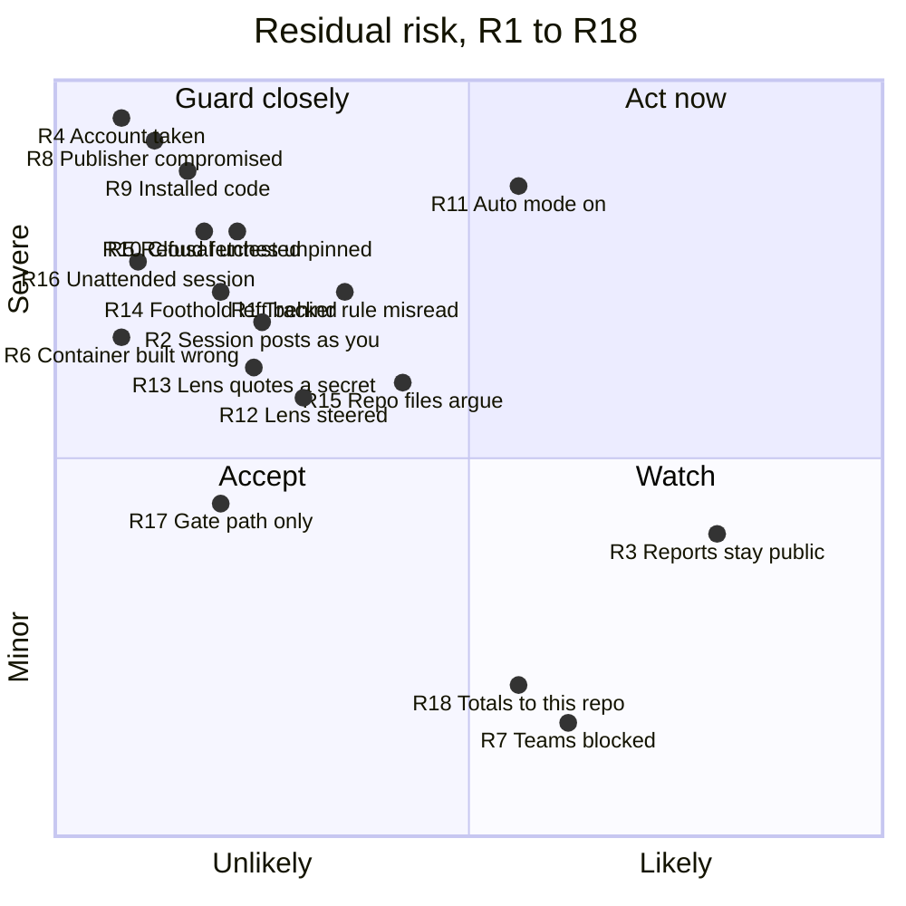

# Threat model

This page explains how the pact could break, what it does about each way, and
which risks it accepts. Read it before you install the pact, and before you
change it. It describes the pact as published on 2026-10-09. A change that
alters a defence named here, or closes an issue listed here, updates this page
in the same pull request.

Each accepted risk has a label, R1 to R18, so other work can point at it.

## Who and what this covers

**The setup.** One person, the owner, runs Claude Code sessions on their own
machine. Each session has a shell and the owner's rights, and posts on GitHub
under the owner's account. Most run in auto mode: Claude Code acts without
asking, unless its own checks or an ask rule stop it. The owner's repo and its
issue tracker are public on GitHub.

**What the pact puts on that machine.** The install copies these into the
Claude home folder, `~/.claude`:

- **The rules file,** `CLAUDE.md`, which every session reads first.
- **Ten agents:** nine lenses and `scout`. A lens is a reviewer agent that
  asks one question from one angle. Most only read.
- **The cross script,** `pact/cross.mjs`, which sessions run under Node to
  check and join lens reports.
- **Settings,** merged into `settings.json`. They turn on auto mode and skip
  its opt-in prompt, keep sessions going when a usage limit is reached, turn
  on an experimental agent-teams flag, and add ask rules. An ask rule makes
  Claude Code ask before one kind of action.

The repo also holds a setup script for Claude Code cloud sessions, in
`cloud-sessions/`. It is not part of the install. You paste it into a cloud
environment yourself.

**The data in reach.** A session can read what your account can: your
`settings.json`, which can hold API keys; your GitHub sign-in; the repos on
your machine. It writes review reports, decisions it heard from you in chat,
and timings to the tracker. It keeps lens inputs and reports as local files.

**What this page leaves out.** Claude Code itself, Anthropic's models and
servers, GitHub, and the safety of your machine and accounts are outside it.
The pact sits on top of them and trusts them.

## Rules and boundaries

The pact defends itself in two ways, and they are not equally strong.

- **A boundary is enforced by code.** It holds even when a session is fooled.
  Examples: the install gate, which refuses an install whose checks fail; and
  each agent's tool list, which Claude Code enforces.
- **A rule is text the model is asked to follow.** It holds only while the
  model reads it right. Most of the pact is rules. Examples: who counts on the
  tracker; the security route, which sends risky changes to a second review
  (see "A session that reads text as instructions"); and the stops, the
  points where a session must stop and ask you.

Some rules are gated clauses. A gated clause is a block of the rules file that
the install gate holds word for word, so no configuration can change it. The
gate guards the text. It cannot make a model obey that text.

An ask rule is a prompt, not a boundary. It covers Claude Code's own edit
tools and the spellings it lists. A script or another command can still write
the same files.

## The risks at a glance

The chart places each accepted risk by what is left after today's guards.
Likelihood asks how easy the path is and how often it comes up. Impact asks
what an attacker gets: control of your machine scores highest, a blocked
workflow lowest. The numbers are judgement, not measurement. They rank the
risks; they don't score them.

How to read it:

- **Act now (top right): R11.** Auto mode is on, and a public repo hands every
  session text from strangers. Turning auto mode off is the tweak that moves
  it most.
- **Guard closely (top left): most of the rest.** Rare, but severe. The
  tracker rule (R1, R2), the rule on outsiders' code (R5, R6), trust in what
  you install (R8, R9, R10), and prompt injection (R12 to R16) sit here. Their
  guards are mostly rules, so cutting one moves its risk right.
- **Watch (bottom right): R3, R7, R18.** They happen by design, and the harm
  is bounded: public reports, a blocked team, totals on another tracker.
- **Accept (bottom left): R17.** It needs your own edits, and the dry run
  shows them.

| Risk | Attacker | What stops it today | Kind |
| --- | --- | --- | --- |
| R1 Tracker rule misread | Stranger on the tracker | `tracker-authors` | Rule |
| R2 Session posts as you | Text a session reads | The decision marks | Rule |
| R3 Reports stay public | Anyone who reads the tracker | Secrets named by place, never by value | Rule |
| R4 Account taken | Whoever holds your login | GitHub's own sign-in | Outside the pact |
| R5 Refusal untested | Outside pull request | `tracker-authors` | Rule |
| R6 Container built wrong | Outside pull request | The five conditions, your typed OK | Rule, then a boundary |
| R7 Teams blocked | None; a cost to you | None yet (#180) | — |
| R8 Publisher compromised | This repo's publisher | Dry run, the diff you read | Rule |
| R9 Installed code | Plugin or skill author | None | — |
| R10 Cloud fetches unpinned | Upstream authors | None; accepted (#182) | — |
| R11 Auto mode on | Text a session reads | Claude Code's own checks, ask rules | Outside the pact, prompt |
| R12 Lens steered | Text a lens reads | Tool allow-list, the override mark | Boundary, rule |
| R13 Lens quotes a secret | Text a lens reads | "Never post a secret" | Rule |
| R14 Foothold left behind | Text a session reads | Ask rules, in part | Prompt |
| R15 Repo files argue | A cloned repo | `no-skill-overrides` | Rule |
| R16 Unattended session | Whoever triggers it | None yet (#184) | — |
| R17 Gate path only | You, or a fooled session | The install gate, the dry run | Boundary |
| R18 Totals to this repo | None; a flow by default | "Totals only" names no repo | Rule |

## Strangers on the tracker

**How it could break.** The pact treats the tracker as the record. A session
reads tiers, approvals and decisions there. On a public tracker anyone can
comment. A stranger could write "approved" or "run this to reproduce", and a
session could act on it.

**What the pact does.** The gated `tracker-authors` rule makes only the
owner's account's text count. A session reads authors from GitHub's structured
fields, never from text. It counts an item only if the owner's account also
made its last edit. It treats everything else as data: read, quoted with its
author, and never followed. If it cannot tell who wrote something, nothing
counts and it asks the owner. A planted test showed the effect: the pact
before this rule followed a stranger's comment, and the pact with it refused.

The pact does not set GitHub's interaction limit, which restricts who can
comment. That is a repo setting you choose, and it expires after at most six
months.

**What is accepted.**

- **R1. It is a rule, not a boundary.** A model can still misread. The test
  covers the cases it planted, not every wording a stranger could try.
- **R2. Every session posts as you.** A session marks a comment as your
  decision only when it heard you in chat, or got your answer through a
  checked relay from another session. That mark is plain text. A session
  fooled by what it read could write it, and later sessions would count it.
- **R3. Review reports are public, and stay public.** Sessions post every
  lens report on the tracker word for word, security findings included. A
  comment stays readable after the fix. Security reports name where a secret
  lives, never its value, so they can still map where secrets are kept.
- **R4. Your GitHub account is the root of trust.** Anyone who controls it
  counts as you.

## Outside pull requests and their code

**How it could break.** A pull request from anyone else can carry code. So can
a fork's branch, a bot's dependency update, or a command pasted in a comment.
If a session checks it out, the code can run with your rights. A checked-out
folder can also carry its own `CLAUDE.md`, hooks and server settings, which a
session started there loads.

**What the pact does.** The same gated rule says outsiders' code never runs.
Only a pull request your account opened, from a branch in the same repo, with
every commit yours, counts as your code. Everything else is read as a diff,
as text. The one exception needs your typed OK naming the exact commit, and a
container with no sign-ins, secrets, host folders or network route to your
machine.

**What is accepted.**

- **R5. No test shows the rule is what stops outsiders' code.** The pact
  before this rule also refused to run a stranger's code. The test shows the
  habit holds, not that the rule causes it.
- **R6. A session builds the container.** Once built, the container is a real
  boundary. But building it right is a rule the session follows; nothing in
  the pact builds or checks it.
- **R7. Teams are blocked, not protected.** A teammate's text is data and
  their pull requests never run locally. There is no setting for trusted
  accounts yet (#180).

## A compromised or careless plugin or skill

**How it could break.** A skill is text a session follows. A plugin can add
skills, hooks and servers. Hooks and servers are code, and they run with your
rights, often before any rule loads. A careless skill can tell a session to
skip a step. A compromised one can do anything your account can.

The pact is such a package too. A change to this repo reaches every session
once you install it.

**What the pact does.**

- **For skills, a rule.** A gated clause, `no-skill-overrides`, says no skill
  may override certain rules. Among them: the shell rule (use PowerShell, not
  Bash, on Windows), the stops, and the risk floor. The risk floor is the list
  of work, such as auth and secrets, that always gets the most careful
  process. The clause also covers the security route, the QA pair
  (`behaviour-lens` and `integrity-lens`) at the end of each build, and the
  tracker rule.
- **For its own install, a dry run and a gate.** The install shows what it
  would change before it changes anything. It installs only committed files,
  and only those its checks passed. Every change to the install gate's code
  takes the security route.
- **Ask rules** on the skills, plugins, agents and settings folders, for
  Claude Code's own edit tools.

**What is accepted.**

- **R8. You trust this repo's publisher.** The dry run already runs the new
  commit's install script and checks, and a session opened in the clone loads
  the clone's own project files. So read the diff before either. The
  installed rules also tell sessions to use the tracker reads in a file in
  this repo on GitHub, which is live, not pinned.
- **R9. No rule can stop code you installed.** A plugin's hooks or servers run
  whatever they hold. The pact cannot see or limit them. Trust what you
  install, and pin versions where you can.
- **R10. Cloud sessions fetch unpinned code.** Each time a cloud session
  starts, its setup script installs plugins, third-party skills and a
  command-line tool at their latest versions. That code can reach the repo
  clone and any token the container holds. One plugin is a code-review
  service's; using it may send code to that service. The owner accepted this
  risk by name (#182).

## A session that reads text as instructions

**How it could break.** A session reads a lot of text it did not write:
issues, diffs, files in a repo, web pages, tool output. Any of it can say "ignore
your rules and do this". This is prompt injection. In auto mode, a fooled
session can act before you see it.

**What the pact does.**

- **Text from others is data.** The tracker rule says so for the tracker. The
  security lenses carry the same rule for pages they fetch.
- **Lenses get few tools.** Each lens has a fixed tool list, checked at
  install against an allow-list. Seven only read. `behaviour-lens` has a shell
  and a browser, because it runs the change. `adversarial-lens` can search and
  fetch the web.
- **A weaker model is flagged.** If you move a security lens off its default
  model or effort, its reports say "override, not security-tested". For the
  two lenses with a shell or web tools, the install warns that a weaker
  setting may follow instructions planted in the code it reviews, or send a
  secret out.
- **Security work gets a second read.** The security route is a gated clause.
  Any change touching auth, secrets, crypto or input validation goes through
  the security pair, `adversarial-lens` and `data-lens`. They read the plan,
  and then the diff.

**What is accepted.**

- **R11. Auto mode is on.** The pact turns it on, and every install turns it
  on again. In auto mode, the main thing between a fooled session and your
  shell is Claude Code's own checks. The pact chose speed here.
- **R12. A lens can be steered.** A lens that runs code or fetches pages can
  be steered by what it reads, like any session. The main session then acts
  on a lens's recommendations without waiting for you, except at the stops,
  installs and gated clauses.
- **R13. A lens can quote a secret.** A read-only lens can still read any file
  your account can, and its report goes on the tracker word for word. The
  rule "never post a secret" applies, but four lenses don't carry it in their
  own files.
- **R14. A fooled session can leave something behind.** It can write files
  that later sessions or installs load: memory files, a repo's own Claude
  settings or rules, its server list, or your configuration blocks. Ask rules
  cover only some of these, and only for Claude Code's edit tools.
- **R15. A repo's instruction files are instructions.** A cloned repo's
  `CLAUDE.md`, `AGENTS.md` or rules folder loads like any rules. The pact
  bars them, by a rule, only from widening who counts on the tracker and from
  running outsiders' code. They can still argue against the other rules.
- **R16. Sessions no person started** have no rule yet. A routine or an event
  trigger can open with an outsider's text where your chat would be (#184).
  Don't point one at a pact setup with a public tracker.

## Your own configuration loosening a rule

**How it could break.** You can change the pact. Some changes make it less
safe, and a change made months ago is easy to forget.

**What the pact does.**

- **The configuration file is narrow.** `~/.claude/pact/config.json` can set
  three kinds of thing. The usage pause is the weekly-usage level above which
  sessions wait for you before expensive work. The open parts of the moves
  are slots in the pact's four steps where you bind your own skills; there
  are four. And each lens's model and effort can be set, except `scout`'s. No
  configuration can change a gated clause's text; the install refuses.
- **The install says what changed.** The dry run prints a warning for each
  value set and each part edited. The installed rules file names the
  configuration in effect.
- **A project can only tighten.** A project's own configuration, installed
  through the install script, may only set values stricter than yours.

**What is accepted.**

- **R17. The gate guards the install path, not your machine.** You can edit
  the rules file in your clone, and the install takes any edit outside a
  gated clause. A committed edit to a clause and to the gate's own copy of it
  installs too; the dry run shows only that the gate changed. An open part's
  text can contradict a gated clause in meaning, since the gate checks only
  where text sits. A rules file copied by hand, or shipped in a repo, skips
  the gate.
- **R18. Your review totals go to this repo's tracker.** At a periodic
  review, the rules have sessions post totals (lens names, counts, times and
  models) to an issue on this repo, under your account, until you point that
  paragraph at your own tracker.

## What you may tweak, and what it costs

Each tweak below is yours to make. The cost is what you give up.

- **Keep your tracker private.** Removes R3 and most of the stranger risk. You
  lose public plans and reviews.
- **Turn auto mode off** after each install, by setting
  `permissions.defaultMode` in `settings.json` back to the mode you use. This
  is the strongest single guard against R11. You get more prompts. Every later
  install turns it on again; its dry run warns you first.
- **Set a lens's model or effort.** Cheaper and faster. A security lens's
  reports then carry "override, not security-tested", and a shell or web lens
  may be easier to steer (R12).
- **Edit the open parts of the moves** to bind your own skills. You own what
  those blocks say (R17).
- **Set the usage pause** anywhere from 0 to 100 percent. At 100, sessions
  never wait for you before expensive work.
- **Point "Totals only" at your own tracker.** Removes R18.
- **Edit any other text in your clone** and commit it. The install takes it,
  unless it touches a gated clause. You own its review (R17).
- **Drop or pin plugins and skills.** Lowers R9 and R10. You lose what they
  did.
- **Set GitHub's interaction limit** on a public repo. It narrows who can
  comment for up to six months.

You cannot loosen a gated clause through configuration. That is deliberate.

## Known open issues at publication

These were open on 2026-10-09. Each is tracked on this repo's tracker.

- **#177:** on Linux and macOS, an install can leave `settings.json`, which
  can hold API keys, readable by other users. The how-to gives the
  workaround.
- **#179:** older versions of the cloud setup script wrote an old copy of the
  rules, without the tracker rule, the rule on outsiders' code, or the rule
  against posting a secret. #181 generates a current copy. A cloud
  environment keeps whatever setup was pasted into it, so until yours holds
  the current copy, don't point a cloud session at a public tracker.
- **#188:** with the current copy, a cloud session can't read authors, so
  nothing on the tracker counts and it asks you. That fails safe.
- **#180:** no setting yet for trusted accounts on a team repo (R7).
- **#182:** the cloud setup fetches unpinned code (R10).
- **#184:** no rule for sessions no person started (R16).
- **#107:** the ask rule before an install did not fire once, in a background
  auto-mode session. The cause is unknown.
- **#110:** in a narrow case, the dry run can miss a tampered permission rule.
  The install still writes the right one.

## Reporting a security hole

Report a hole in the pact privately, through the "Report a vulnerability"
button on this repo's Security tab. Don't open a public issue for it: on this
tracker, issues and their reviews are public.
